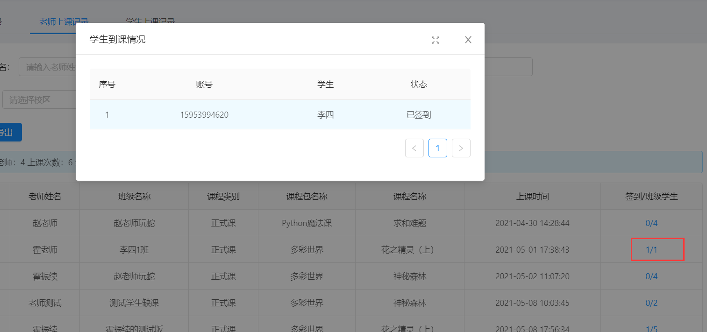

<div class="snote done"><p>本笔记是本人在开发中遇到的问题，由于此前未接触过，故此记录，方便以后的自己查看</p></div>

### 相关方法解读

```javascript
//初始化字典配置 在自己页面定义
this.initDictConfig();
```

```javascript
// 加载页面参数
this.initPageParams()
```

```javascript
//页面刷新
this.loadData();
```

### 页面跳转(路由)

示例：

定义一个事件，点击触发方法

```vue
<a-menu-item>
    <a @click='handleClassInstance(record)'>课堂实例</a>
</a-menu-item>
```

下方定义相对应的方法

```javascript
// 跳转 添加 课堂实例
handleClassInstance(row) {
    console.log('row.id >>', row.id)
    // 写上想要跳转的地址
    this.$router.push({ path: '/course-management/case-study', query: { id: row.id } })
},
```

**具体实现过程**：

**List页面**

跳转到对应的页面之后,以新增方法为例

替换掉系统自带的新增按钮

```vue
<a-button @click='handleAdd({courseId:filters.courseId})' v-if='filters.courseId!=null' type='primary' icon='plus'>新增</a-button>
```

下方 `methods` 中加入以下代码

```javascript
initPageParams() {
    if (this.$route.query && this.$route.query.id) {
        const id = this.$route.query.id

        Object.assign(this.filters, { courseId: id })
    }
},
```

**From页面**

在表单页加入一个 input输入框，用来接受传过来的 课程id，设置 隐藏

```vue
<a-input-number v-model='model.courseId' hidden />
```

在下方JS代码中，Props代码块里定义一个 courseId

```javascript
courseId: {
    type: String,
    default: null
}
```

在下方 `methods` 里，修改系统自带的添加方法

```javascript
add(v) {
    console.log('add >> F', v)
    const module = {
        courseId:  v.courseId ,
        moduleName:  v.moduleName ,
        moduleTitle:  v.moduleTitle ,
    }
    Object.assign(this.modelDefault, module)
    this.edit(this.modelDefault)
},
```

v  是什么，....暂时不知道这是从哪里来的

**Modal页面**

最后在 `modal`页面修改一下  ==add==方法

```javascript
add (v) {
    console.log('add >> M', v);
    this.visible=true
    this.$nextTick(()=>{
        this.$refs.realForm.add(v);
    })
},
```

致此大功告成。

### 配置老师课程权限

用到了插槽，就是在 表格 的那个页面，点击某一字段的值，会出来一个弹窗，然后选择对应的权限


1、首先在合适的位置加入代码，模板都类似，相差不是特别大

**注意：** `slot`的名字就是插槽的名字，下方会使用

```vue
<template slot='coursePower' slot-scope='text,record'>
<a @click='handleCoursePower(record)'>{{ text }}</a>
</template>
```

2、在`<a-table></a-table>`外面，加入以下代码

```vue
      <j-modal
        title='课程权限配置'
        :visible='visible'
        :confirmLoading='confirmLoading'
        @ok='handleSubmit'
        @cancel='handleCancel'
        wrapClassName='j-depart-select-modal'
        switchFullscreen
        cancelText='关闭'>
        <a-spin tip='Loading...' :spinning='confirmLoading'>
          <a-tree
            v-model='checkedKeys'
            checkable
            :expanded-keys='expandedKeys'
            :auto-expand-parent='autoExpandParent'
            :selected-keys='selectedKeys'
            :tree-data='treeData'
            @expand='onExpand'
            @select='onSelect'
          />
        </a-spin>
      </j-modal>
```

3、在列表显示的地方加入代码

```javascript
          {
            title:'课程权限',
            align:"center",
            dataIndex: 'coursePower',
                // 加入下方代码，名字对应上方 slot 的名字
            scopedSlots: { customRender: 'coursePower' }
          },
```

4、弹窗之后里面的具体实现等等根据实际情况编写


### 页面排序

在  前端列表 页面加入以下代码即可

```javascript
sorter: true,
customRender:function (text) {
   return !text?"":(text.length>20?text.substr(0,20):text)
}
```

二者缺一不可！

示例：

```javascript
          {
            title:'创建时间',
            align:"center",
            sorter: true,
            dataIndex: 'createTime',
            customRender:function (text) {
              return !text?"":(text.length>20?text.substr(0,20):text)
            }
          },
```


### 自定义下拉框查询

参考链接：https://blog.csdn.net/zhengtornado/article/details/106979079


控制器里写相关查询代码


**查询页面**

前端页面

`:key="index.toString()"`，这段代码去掉会报错

```vue
<a-col :xl="6" :lg="7" :md="8" :sm="24">
    <a-form-item label="任课老师">
        <a-select  v-model="queryParam.teacherName" placeholder="请选择任课老师">
            <a-select-option v-for="item in projectNameList2" :key="index.toString()" :value="item.name"> {{item.name}}</a-select-option>
        </a-select>
    </a-form-item>
</a-col>
```


data（）里定义以下参数

```javascript
projectNameList:[],
teacherName:'',
index:'',
```

url 里写入对应控制器的路径

```javascript
 teacherList:'/School/TeacherList'
```

methods 里面定义

```javascript
getName(){
    postAction(this.url.courseList).then((res) =>{
        if (res.success){
            this.projectNameList=res.result;
            console.log(this.projectNameList)
        }
    })
},
```


**添加页面**

```vue
<a-col :span="24">
    <a-form-model-item label="任课老师" :labelCol="labelCol" :wrapperCol="wrapperCol" prop="teacherName">
        <a-select v-model="model.teacherName" v-decorator="['teacherName', validatorRules.teacherName]">
            <a-select-option  v-for="(item, index)  in projectNameList2" :key="index.toString()" :value="item.name" > {{item.name}}</a-select-option>
        </a-select>
    </a-form-model-item>
</a-col>
```

modal里定义相应的值

```code
projectNameList:[],
projectNameList2:[],
model:{
    classCourse:'',
    teacherName:''
},
```

其他与添加时一样。


### 超长文本截取

1、引入相关组件

```code
import JEllipsis from '@/components/jeecg/JEllipsis'
```

2、在`components`里加入

```code
JEllipsis
```

3、在 data() 与 return{}中间加入

```javascript
// 20 代表的是长度，加入后会有些地方报红，但不影响使用
let ellipsis = (v, l = 20) => (<j-ellipsis value={v} length={l}/>)
```

4、在想要截取的字段下方加入

```javascript
customRender:(t) => ellipsis(t)
```

完成！

参考链接：https://blog.csdn.net/github_39019743/article/details/105274552


### 字典遇到过的问题

前几天遇到了一个问题 ，查询结果一直显示为 null  

`xxx_dictText`   就是这个字段，后来发现是实体类的原因，用字典注解的这个字段，首字母是大写的。于是我便改为小写实验了一下，竟然成功了。

总结：字典的实体类字段 首字母尽量不要用大写 ，否则可能会造成某些异常问题。

### 时间范围查询

由于是自己重写的方法，所有没有调用系统自带的那些查询条件，就摸索了一套解决方案。

```xml
            <if test="teaCourseRecordVo.classUpTime_begin != null and teaCourseRecordVo.classUpTime_begin != '' and teaCourseRecordVo.classUpTime_end != null and teaCourseRecordVo.classUpTime_end != ''">
                and cls.`class_up_time` between #{teaCourseRecordVo.classUpTime_begin} and #{teaCourseRecordVo.classUpTime_end}
            </if>
```

xml 里的具体格式就是这样，相对于的前端代码如下

```vue
          <a-col :xl="10" :lg="11" :md="12" :sm="24">
            <a-form-item label="上课时间">
              <a-range-picker
                :ranges="{ 今天: [moment(), moment()], '本月': [moment(), moment().endOf('month')] }"
                style="width: 350px"
                v-model="queryParam.classUpTime"
                show-time
                format="YYYY-MM-DD HH:mm:ss"
                :placeholder="['开始时间', '结束时间']"
                @change="onDateChange"
                @ok="onDateOk"
              />
            </a-form-item>
          </a-col>
```

注意：需要导入组件

```javascript
  import { filterObj } from '@/utils/util'
  import moment from 'moment'
    components: {
      filterObj, moment
    },
```

定义参数：

```javascript
// 查询条件
queryParam: {
    createTimeRange:[],
},
```

用到的方法

```javascript
/**
       *  时间查询 开始
       */
      moment,
      getQueryParams() {
        var param = Object.assign({}, this.queryParam, this.isorter)
        param.field = this.getQueryField()
        param.pageNo = this.ipagination.current
        param.pageSize = this.ipagination.pageSize
        delete param.classUpTime // 时间参数不传递后台
        if (this.superQueryParams) {
          param['superQueryParams'] = encodeURI(this.superQueryParams)
          param['superQueryMatchType'] = this.superQueryMatchType
        }
        return filterObj(param)
      },
      // 重置
      searchReset() {
        var that = this
        that.queryParam = {} //清空查询区域参数
        that.loadData(this.ipagination.current)
      },
      onDateChange: function(value, dateString) {
        console.log(dateString[0], dateString[1])
        this.queryParam.classUpTime_begin = dateString[0]
        this.queryParam.classUpTime_end = dateString[1]
      },
       onDateOk(value) {
        console.log(value)
      }
      /**
       * 时间查询 END
       */
```

这样就可以实现具体的功能了。

本方法参考自：https://blog.csdn.net/qq_38215042/article/details/110875770

### Tea标签页使用

这是一个选项卡切换组件

官方示例：

```vue
<template>
  <div>
    <a-tabs default-active-key="1" @change="callback">
      <a-tab-pane key="1" tab="Tab 1">
        Content of Tab Pane 1
           这里可以换成自定的页面
      </a-tab-pane>
      <a-tab-pane key="2" tab="Tab 2" force-render>
        Content of Tab Pane 2
           这里可以换成自定的页面
      </a-tab-pane>
      <a-tab-pane key="3" tab="Tab 3">
        Content of Tab Pane 3
          这里可以换成自定的页面
      </a-tab-pane>
    </a-tabs>
  </div>
</template>
<script>
export default {
  data() {
    return {};
  },
  methods: {
    callback(key) {
      console.log(key);
    },
  },
};
</script>
```

### 弹窗的使用

近期项目中遇到了一个功能，在查询老师上课记录的时候，需要显示出`签到/班级人数`，并且点击后会弹出一个对话框，显示出对应的数据。

效果如下：



特此记录一下，防止时间久了，自己会遗忘。

#### 实现

先定义一个插槽，点击会触发弹窗的方法

```vue
<span slot="action" slot-scope="text, record">
    <a @click="handleTest(record)">{{text}}</a>
</span>
```

```javascript
          {
            title: '签到/班级学生',
            align: 'center',
            dataIndex: 'peopleCounting',
            scopedSlots: { customRender: 'action' }
          }

		//方法
      handleTest(v) {
        this.visible = true
        // console.log('>>>>>', v)
        getAction(this.url.listCondition, {
          classId: v.classId,
          courseName: v.courseName
        }).then((res) => {
          if (res.success) {
            this.stuList = res.result.records
          }
        })
      },
      handleCancel() {
        this.handleClear()
      },
      handleClear() {
        this.visible = false
      },
```

**需要定义好的值**

```javascript
visible: false,
confirmLoading: false
```

在标签`</a-table>`的外面定义弹窗

```vue
      <j-modal
        title='学生到课情况'
        :visible='visible'
        :confirmLoading='confirmLoading'
        width="700px"
        @cancel='handleCancel'
        :footer="null" 
        switchFullscreen
        cancelText='关闭'>
        <a-spin tip='Loading...' :spinning='confirmLoading'>
          <a-table
            rowKey="id"
            :columns="columnstwo"
            :dataSource="stuList"
          >
          </a-table>
        </a-spin>
      </j-modal>
```

**定义弹窗里面表格的字段**

```javascript
        columnstwo: [
          {
            title: '序号',
            dataIndex: '',
            key: 'rowIndex',
            width: 60,
            align: 'center',
            customRender: function(t, r, index) {
              return parseInt(index) + 1
            }
          },
          {
            title: '账号',
            align: 'center',
            dataIndex: 'accountNumber'
          },
          {
            title: '学生',
            align: 'center',
            dataIndex: 'studentName'
          },
          {
            title: '状态',
            align: 'center',
            dataIndex: 'type_dictText'
          }
        ],
```

其他调用对应的方法即可。


### 实现分页

默认使用的是 `table`分页，实现分页只需要加入一个配置即可

```vue
:pagination="pagination"
```

而 `list` 却不能这样使用

记录下 copy 别人的分页

```vue
 <a-list 	:pagination="ipagination"  
            :data-source="dataSource">
</a-list>
```

以上两个设置必须要有，第一个是分页设置的一个方法，第二个是数据源，及获取的地址

方法：

```javascript
        ipagination: {
          current: 1,
          pageSize: 8,
          showTotal: (total, range) => {
            return range[0] + '-' + range[1] + ' 共' + total + '条'
          },
          showSizeChanger: false,
          showQuickJumper: false,
          total: 0,
          onChange: function(page, pageSize) {
            this.current = page
          }
        }
```

```javascript
    watch: {
      'ipagination.current': function(val) {
        this.loadData(val)
      }
    },
```


#### 不定时更新~

