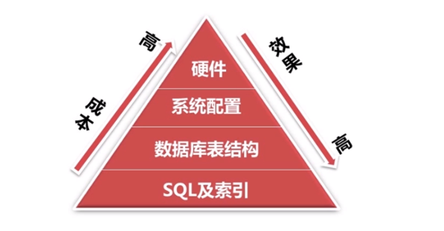

 关于MySQL数据库优化 

## 了解为什么要数据库优化

### 数据库优化的目的

#### 避免出现页面访问错误

- 由于数据库连接timeout产生页面5xx错误
- 由于慢查询造成页面无法加载
- 由于阻塞造成数据无法提交

#### 增加数据库的稳定性

- 很多数据库问题都是由于低效的查询引起的

#### 优化用户体验

- 流畅页面的访问速度
- 良好的网站功能体验

## 了解数据库优化的几个方式

### 优化方式

#### 可以从几个方面进行数据库优化

#### 如何查看SQL的查询效率

在日常工作中，我们有时会开慢查询去记录一些执行时间比较久的SQL语句，找出这些SQL语句并不意味着完事了，此时我们常常用到**explain**这个命令来查看这个SQL语句的执行计划，查看该SQL语句有没有使用上了索引，有没有做全表扫描，这些都可以通过**explain**命令来查看。所以我们深入了解MySQL的基于开销的优化器，还可以获得很多可能被优化器考虑到的访问策略的细节，以及当运行SQL语句时哪种策略预计会被优化器采用

- --实际SQL，查找用户名为Jefabc的员工
- select * from emp where name ='Jefabc' ;
- -- 查看SQL是否使用索引，前面加上explain即可
- explain  select * from emp where name ='Jefabc' ;

#### 概要描述：

**explain 出来的信息有10列，分别是id、select_type、table、type、possible_keys、key、key_len、ref、rows、Extra。**

1. id：选择标识符
2. select_type： 表示查询的类型
3. table： 输出结果的集
4. type： 表示表的连接类型
   - 对外访问方式，表示MySQL在表中找到所需行的方式，又称“访问类型”

## 使用索引和优化数据表结构来优化数据库查询

