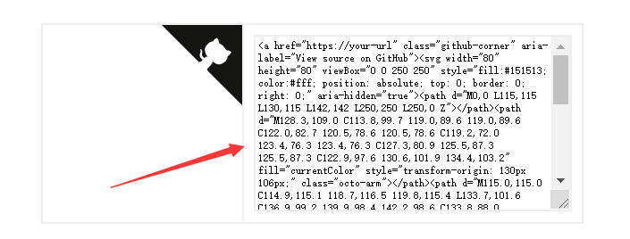
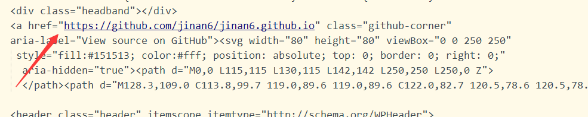
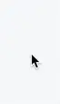

#### 前言

> 搭建完博客之后，感觉原有的主题太单调了，于是这几天找了很多的教程，也踩了很多的坑，因为教程上的版本和使用的版本不同，很多地方都不相同，往往一个小功能试验好多种方式，才能达到想要的效果。在这里记录下成功过的案例，方便以后查看。或许以后有朝一日，还能帮助他人

<!--more-->

#### 本文目录

- 在右上角或者左上角实现fork me on github
- 实现点击出现桃心效果
- 修改文章内链接文本样式
- 修改文章底部的那个带#号的标签
- 在每篇文章末尾统一添加“本文结束”标记
- 新增看板娘(能说话、能换装)

#### 1、在右上角或者左上角实现fork me on github

###### 效果图：

###### 具体实现方法：

点击[这里](https://github.com/blog/273-github-ribbons) 或者 [这里](http://tholman.com/github-corners/)挑选自己喜欢的样式，并复制代码。 例如，我是复制如下代码：



然后粘贴刚才复制的代码到**\themes\next\layout\_layout.swig**文件中，放在**<div class="headband"></div>**的下面，并把**href**改为你自己的**GitHub**地址

#### 2、实现点击出现桃心效果

###### 效果图：



###### 具体实现方法：

在**\themes\next\source\js/src**目录下新建<span style="color:red">**love.js**</span>输入以下代码

````javascript
!function(e,t,a){function n(){c(".heart{width: 10px;height: 10px;position: fixed;background: #f00;transform: rotate(45deg);-webkit-transform: rotate(45deg);-moz-transform: rotate(45deg);}.heart:after,.heart:before{content: '';width: inherit;height: inherit;background: inherit;border-radius: 50%;-webkit-border-radius: 50%;-moz-border-radius: 50%;position: fixed;}.heart:after{top: -5px;}.heart:before{left: -5px;}"),o(),r()}function r(){for(var e=0;e<d.length;e++)d[e].alpha<=0?(t.body.removeChild(d[e].el),d.splice(e,1)):(d[e].y--,d[e].scale+=.004,d[e].alpha-=.013,d[e].el.style.cssText="left:"+d[e].x+"px;top:"+d[e].y+"px;opacity:"+d[e].alpha+";transform:scale("+d[e].scale+","+d[e].scale+") rotate(45deg);background:"+d[e].color+";z-index:99999");requestAnimationFrame(r)}function o(){var t="function"==typeof e.onclick&&e.onclick;e.onclick=function(e){t&&t(),i(e)}}function i(e){var a=t.createElement("div");a.className="heart",d.push({el:a,x:e.clientX-5,y:e.clientY-5,scale:1,alpha:1,color:s()}),t.body.appendChild(a)}function c(e){var a=t.createElement("style");a.type="text/css";try{a.appendChild(t.createTextNode(e))}catch(t){a.styleSheet.cssText=e}t.getElementsByTagName("head")[0].appendChild(a)}function s(){return"rgb("+~~(255*Math.random())+","+~~(255*Math.random())+","+~~(255*Math.random())+")"}var d=[];e.requestAnimationFrame=function(){return e.requestAnimationFrame||e.webkitRequestAnimationFrame||e.mozRequestAnimationFrame||e.oRequestAnimationFrame||e.msRequestAnimationFrame||function(e){setTimeout(e,1e3/60)}}(),n()}(window,document);
````

然后打开**\themesnext\layout\layout.swig**在末尾增加以下代码

````javascript
<!-- 页面点击小红心 -->
<script type="text/javascript" src="/js/src/love.js"></script>
````

#### 3、修改文章内链接文本样式

###### 效果图：

###### 具体实现方法：

打开**\themes\next\source\css\_common\components\post\post.styl**在末尾添加以下**CSS**样式

````css
// 文章内链接文本样式
.post-body p a{
  color: #0593d3;
  border-bottom: none;
  border-bottom: 1px solid #0593d3;
  &:hover {
    color: #fc6423;
    border-bottom: none;
    border-bottom: 1px solid #fc6423;
  }
}
````

#### 4、修改文章底部的那个带#号的标签

###### 效果图：

###### 具体实现方法：

打开**\themes\next\layout\_macro\post.swig**搜索

````html
tag_indicate = '#'
````


改成

````html
tag_indicate = '<i class="fa fa-tag"></i>'
````

###### 5、在每篇文章末尾统一添加“本文结束”标记

###### 效果图：

###### 具体实现方法：

在**\themes\next\layout\_macro**中新建**passage-end-tag.swig**

并添加以下内容

````java
<div>
    
        <div style="text-align:center;color: #ccc;font-size:14px;">-------------本文结束<i class="fa fa-paw"></i>感谢您的阅读-------------</div>
    
</div>

````

接着打开**\themes\next\layout\_macro\post.swig** 在<span style="color:red">**post-footer**</span>之前加入以下代码

````html
<div>
	    
	      
	    
	  </div>
````


然后打开主题配置文件(**主题目录下的_config.yml**)，在末尾添加以下代码：

````yaml
# 文章末尾添加“本文结束”标记
passage_end_tag:
  enabled: true
````

#### 6、新增看板娘(能说话、能换装)

###### 效果图：


###### 具体实现方法：

1、下载 [张书樵大神的项目](https://github.com/stevenjoezhang/live2d-widget)，解压到本地博客目录的 `themes/next/source` 下，修改文件夹名为 `live2d-widget`，修改项目中的 `autoload.js` 文件，如下：
将

````java
const live2d_path = "https://cdn.jsdelivr.net/gh/stevenjoezhang/live2d-widget/";
````

改为

````java
const live2d_path = "/live2d-widget/";
````

2、打开在`/themes/next/layout/_layout.swig`，在**head标签**中加入：

````javas
<script src="https://cdn.jsdelivr.net/npm/jquery/dist/jquery.min.js"></script>
<link rel="stylesheet" href="https://cdn.jsdelivr.net/npm/font-awesome/css/font-awesome.min.css">
````

在末尾加入：

````javas
<script src="/live2d-widget/autoload.js"></script>
````

3、在 `主题配置文件` 中,新增如下内容：

````java
live2d:
  enable: true
````

4、想修改看板娘大小、位置、格式、文本内容等，可查看并修改 `waifu-tips.js` 、 `waifu-tips.json` 和 `waifu.css`。

未完待续。。。