#### 前言

> 搭建完博客之后，感觉原有的主题太单调了，于是这几天找了很多的教程，也踩了很多的坑，因为教程上的版本和使用的版本不同，很多地方都不相同，往往一个小功能试验好多种方式，才能达到想要的效果。在这里记录下成功过的案例，方便以后查看。或许以后有朝一日，还能帮助他人

<!--more-->

#### 本文目录

- 在右上角或者左上角实现fork me on github
- 实现点击出现桃心效果
- 修改文章内链接文本样式
- 修改文章底部的那个带#号的标签
- 在每篇文章末尾统一添加“本文结束”标记
- 新增看板娘(能说话、能换装)
- 开启代码块复制功能及更换样式
- 打字特效
- 个性化回到顶部
- 文章末尾版权声明
- 添加图片灯箱
- 相关文章推荐
- 站点及文章字数统计
- 站点运行时间统计
- 实现简体 / 繁体一键切换
- 开启本地博客搜索功能
- 设置侧栏阅读进度百分比
- 文章置顶
- 精品文章
- 博客加入canvas粒子时钟
- 为站点添加标题崩溃特效
- 添加valine评论系统
- 用LeanClound给hexo+next博客添加文章阅读数
- 博主头像圆形并旋转


### 一些基本的设置参考官方文档：[Next官方文档](http://theme-next.iissnan.com/getting-started.html)

#### 1、在右上角或者左上角实现fork me on github

###### 效果图：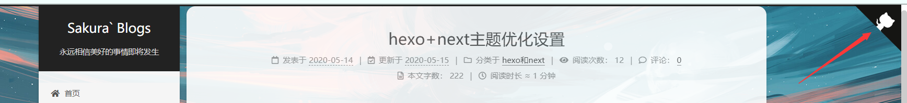

###### 具体实现方法：

点击[这里](https://github.com/blog/273-github-ribbons) 或者 [这里](http://tholman.com/github-corners/)挑选自己喜欢的样式，并复制代码。 例如，我是复制如下代码：


然后粘贴刚才复制的代码到**\themes\next\layout\_layout.swig**文件中，放在**<div class="headband"></div>**的下面，并把**href**改为你自己的**GitHub**地址

#### 2、实现点击出现桃心效果

###### 效果图：


###### 具体实现方法：

在**\themes\next\source\js/src**目录下新建<span style="color:red">**love.js**</span>输入以下代码

````javascript
!function(e,t,a){function n(){c(".heart{width: 10px;height: 10px;position: fixed;background: #f00;transform: rotate(45deg);-webkit-transform: rotate(45deg);-moz-transform: rotate(45deg);}.heart:after,.heart:before{content: '';width: inherit;height: inherit;background: inherit;border-radius: 50%;-webkit-border-radius: 50%;-moz-border-radius: 50%;position: fixed;}.heart:after{top: -5px;}.heart:before{left: -5px;}"),o(),r()}function r(){for(var e=0;e<d.length;e++)d[e].alpha<=0?(t.body.removeChild(d[e].el),d.splice(e,1)):(d[e].y--,d[e].scale+=.004,d[e].alpha-=.013,d[e].el.style.cssText="left:"+d[e].x+"px;top:"+d[e].y+"px;opacity:"+d[e].alpha+";transform:scale("+d[e].scale+","+d[e].scale+") rotate(45deg);background:"+d[e].color+";z-index:99999");requestAnimationFrame(r)}function o(){var t="function"==typeof e.onclick&&e.onclick;e.onclick=function(e){t&&t(),i(e)}}function i(e){var a=t.createElement("div");a.className="heart",d.push({el:a,x:e.clientX-5,y:e.clientY-5,scale:1,alpha:1,color:s()}),t.body.appendChild(a)}function c(e){var a=t.createElement("style");a.type="text/css";try{a.appendChild(t.createTextNode(e))}catch(t){a.styleSheet.cssText=e}t.getElementsByTagName("head")[0].appendChild(a)}function s(){return"rgb("+~~(255*Math.random())+","+~~(255*Math.random())+","+~~(255*Math.random())+")"}var d=[];e.requestAnimationFrame=function(){return e.requestAnimationFrame||e.webkitRequestAnimationFrame||e.mozRequestAnimationFrame||e.oRequestAnimationFrame||e.msRequestAnimationFrame||function(e){setTimeout(e,1e3/60)}}(),n()}(window,document);
````

然后打开**\themesnext\layout\layout.swig**在末尾增加以下代码

````javascript
<!-- 页面点击小红心 -->
<script type="text/javascript" src="/js/src/love.js"></script>
````

#### 3、修改文章内链接文本样式

###### 效果图：

###### 具体实现方法：

打开**\themes\next\source\css\_common\components\post\post.styl**在末尾添加以下**CSS**样式

````css
// 文章内链接文本样式
.post-body p a{
  color: #0593d3;
  border-bottom: none;
  border-bottom: 1px solid #0593d3;
  &:hover {
    color: #fc6423;
    border-bottom: none;
    border-bottom: 1px solid #fc6423;
  }
}
````

#### 4、修改文章底部的那个带#号的标签

###### 效果图：

###### 具体实现方法：

打开**\themes\next\layout\_macro\post.swig**搜索

````html
tag_indicate = '#'
````


改成

````html
tag_indicate = '<i class="fa fa-tag"></i>'
````

###### 5、在每篇文章末尾统一添加“本文结束”标记

###### 效果图：

###### 具体实现方法：

在**\themes\next\layout\_macro**中新建**passage-end-tag.swig**

并添加以下内容

````java
<div>
    
        <div style="text-align:center;color: rgba(234,16,61,.569);font-size: 18px;margin-top: 20px;" class="tag-end">-------------本文结束<i class="fa fa-paw"></i>感谢您的阅读-------------</div>
    
</div>


````

接着打开**\themes\next\layout\_macro\post.swig** 在<span style="color:red">**post-footer**</span>之前加入以下代码

````html
<div>
	    
	      
	    
	  </div>
````

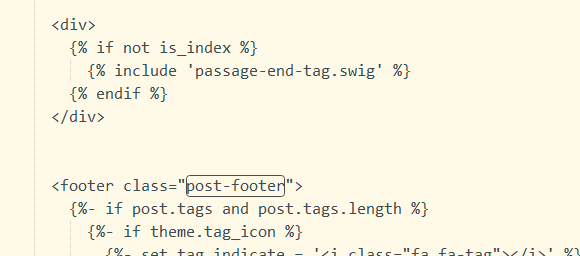

然后打开主题配置文件(**主题目录下的_config.yml**)，在末尾添加以下代码：

````yaml
# 文章末尾添加“本文结束”标记
passage_end_tag:
  enabled: true
````

#### 6、新增看板娘(能说话、能换装)

###### 效果图：


###### 具体实现方法：

1、下载 [张书樵大神的项目](https://github.com/stevenjoezhang/live2d-widget)，解压到本地博客目录的 `themes/next/source` 下，修改文件夹名为 `live2d-widget`，修改项目中的 `autoload.js` 文件，如下：
将

````java
const live2d_path = "https://cdn.jsdelivr.net/gh/stevenjoezhang/live2d-widget/";
````

改为

````java
const live2d_path = "/live2d-widget/";
````

2、打开在`/themes/next/layout/_layout.swig`，在**head标签**中加入：

````javas
<script src="https://cdn.jsdelivr.net/npm/jquery/dist/jquery.min.js"></script>
<link rel="stylesheet" href="https://cdn.jsdelivr.net/npm/font-awesome/css/font-awesome.min.css">
````

在末尾加入：

````javas
<script src="/live2d-widget/autoload.js"></script>
````

3、在 `主题配置文件` 中,新增如下内容：

````java
live2d:
  enable: true
````

4、想修改看板娘大小、位置、格式、文本内容等，可查看并修改 `waifu-tips.js` 、 `waifu-tips.json` 和 `waifu.css`。

#### 7、开启代码块复制功能及更换样式

在主题配置文件中修改以下代码：

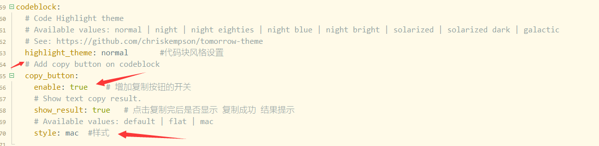

自己根据需要修改即可

#### 8、打字特效

###### 效果图：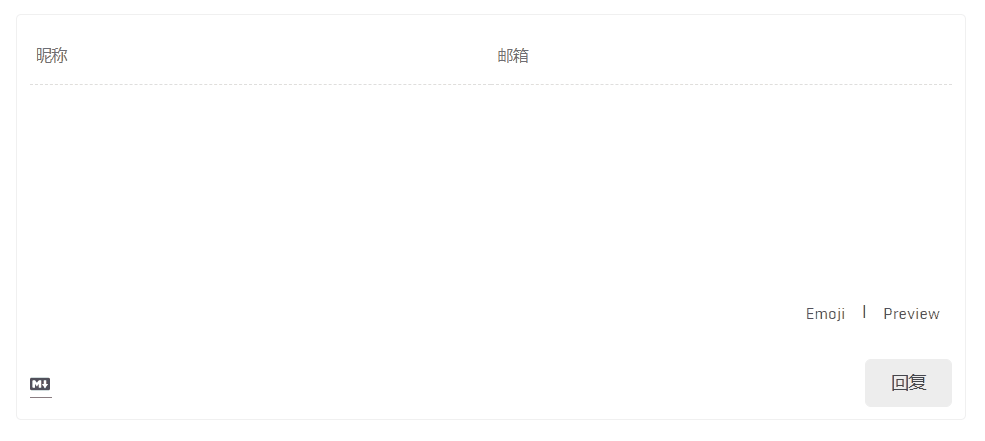

###### 具体实现方法：

点击下方按钮下载相应的脚本，并置于 themes\next\source\js\ 目录下：

[打字特效](https://script-1256884783.file.myqcloud.com/activate-power-mode.min.js)

在主题自定义布局文件中添加以下代码：

````javascript
themes\next\layout\_custom\custom.swig
{# 打字特效 #}

  <script src="/js/activate-power-mode.min.js"></script>
  <script>
    POWERMODE.colorful = {{ theme.typing_effect.colorful }};
    POWERMODE.shake = {{ theme.typing_effect.shake }};
    document.body.addEventListener('input', POWERMODE);
  </script>

````

如果 custom.swig 文件不存在，需要手动新建并在布局页面中 body 末尾引入：

````javas

````

在主题配置文件中添加以下代码：

````javascript
hemes\next\_config.yml
# typing effect
typing_effect:
  colorful: true  # 礼花特效
  shake: false  # 震动特效

````

#### 9、个性化回到顶部

###### 具体实现方法：

首先，找到自己喜欢的图片素材放到 source\images\ 目录下。

你可以点击下方按钮下载本站所使用的小猫上吊素材（ 小猫咪这么可爱，当然要多放点孜然啦…）



然后在自定义样式文件中添加如下代码：

````javas
themes\next\source\css\_custom\custom.styl
//自定义回到顶部样式
.back-to-top {
  right: 60px;
  width: 70px;  //图片素材宽度
  height: 900px;  //图片素材高度
  top: -900px;
  bottom: unset;
  transition: all .5s ease-in-out;
  background: url("/images/scroll.png");

  //隐藏箭头图标
  > i {
    display: none;
  }

  &.back-to-top-on {
    bottom: unset;
    top: 100vh < (900px + 200px) ? calc( 100vh - 900px - 200px ) : 0px;
  }
}
````

重新运行刷新浏览器即可

##### 10、文章末尾版权声明

###### 效果图：

###### 具体实现方法：

在主题配置文件中开启文章底部的版权声明，版权声明默认使用 [CC BY-NC-SA 4.0](https://creativecommons.org/licenses/by-nc-sa/4.0/) 许可协议，用户可以根据自身需要修改 `licence` 字段变更协议。

###### 具体实现方法：

编辑 主题配置文件，修改如下配置：

````javas
creative_commons:
  license: by-nc-sa
  sidebar: false
  post: true    # 默认显示版权信息
  language:
````

#### 11、添加图片灯箱

添加灯箱功能，实现点击图片后放大聚焦图片，并支持幻灯片播放、全屏播放、缩略图、快速分享到社交媒体等，该功能由 [fancyBox](https://github.com/fancyapps/fancybox) 提供。

在根目录下执行以下命令安装相关依赖：

````javas
git clone https://github.com/theme-next/theme-next-fancybox3 themes/next/source/lib/fancybox

````

在主题配置文件中设置 `fancybox: true`：

````javas
themes\next_config.yml
fancybox: true

````

#### 12、相关文章推荐

###### 效果图：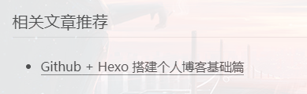

###### 具体实现方法：

在站点根目录中执行以下命令安装依赖：

````javas
npm install hexo-related-popular-posts --save

````

在主题配置文件中开启相关文章推荐功能：

````javas
related_posts:
  enable: true
  title: 相关文章推荐
  display_in_home: false
  params:
    maxCount: 5
````

#### 13、站点及文章字数统计

###### 效果图：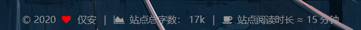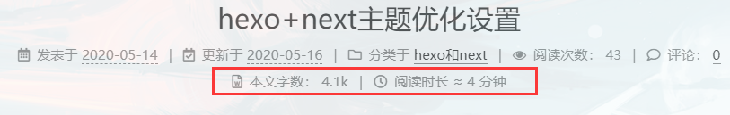

###### 具体实现方法：

在根目录下执行如下命令安装相关依赖：

````javas
npm install hexo-symbols-count-time --save
````

启用该功能需要同时修改站点配置文件和主题配置文件。

将如下配置项添加到**站点配置文件**中，这些配置项主要用于控制每项统计信息是否显示。

````javas
#字数与时间 
  symbols_count_time:
  symbols: true                # 文章字数统计
  time: true                   # 文章阅读时长
  total_symbols: true          # 站点总字数统计
  total_time: true             # 站点总阅读时长
  exclude_codeblock: false     # 排除代码字数统计
````

主题配置文件：

````javas
symbols_count_time:
  separated_meta: true  #显示属性名称,设为false后只显示图标和统计数字,不显示属性的文字
  item_text_post: true  #显示属性名称,设为false后只显示图标和统计数字,不显示属性的文字
  item_text_total: true #底部footer是否显示字数统计属性文字(如站点总字数,站点阅读时长 ≈ 1 分钟)
  awl: 4		#平均每个字符的长度
  wpm: 275
````

#### 14、站点运行时间统计

###### 效果图：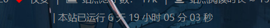

###### 具体实现方法：

打开**\themes\next\layout\_partials\footer.swig**,在末尾添加以下内容：

````javas
<span id="timeDate">载入天数...</span><span id="times">载入时分秒...</span>
<script>
    var now = new Date();
    function createtime() {
        var grt = new Date("05/10/2020 22:00:00"); //此处修改你的建站时间或者网站上线时间 
        now.setTime(now.getTime() + 250);
        days = (now - grt) / 1000 / 60 / 60 / 24;
        dnum = Math.floor(days);
        hours = (now - grt) / 1000 / 60 / 60 - (24 * dnum);
        hnum = Math.floor(hours);
        if (String(hnum).length == 1) {
            hnum = "0" + hnum;
        }
        minutes = (now - grt) / 1000 / 60 - (24 * 60 * dnum) - (60 * hnum);
        mnum = Math.floor(minutes);
        if (String(mnum).length == 1) {
            mnum = "0" + mnum;
        }
        seconds = (now - grt) / 1000 - (24 * 60 * 60 * dnum) - (60 * 60 * hnum) - (60 * mnum);
        snum = Math.round(seconds);
        if (String(snum).length == 1) {
            snum = "0" + snum;
        }
        document.getElementById("timeDate").innerHTML = "  本站已运行 " + dnum + " 天 ";
        document.getElementById("times").innerHTML = hnum + " 小时 " + mnum + " 分 " + snum + " 秒";
    }
    setInterval("createtime()", 250);
</script>
````

#### 15、添加站点访问量统计

###### 效果图：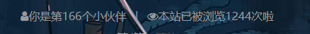

###### 具体实现方法：

打开主题配置文件，修改以下配置：

````javas
# Show Views / Visitors of the website / page with busuanzi.
# Get more information on http://ibruce.info/2015/04/04/busuanzi
busuanzi_count:
  enable: true              # 设true 开启
  # total_visitors: true       # 总阅读人数（uv数）
  # total_visitors_icon: user  # 阅读总人数的图标
  # total_views: true          # 总阅读次数（pv数）
  # total_views_icon: eye      # 阅读总次数的图标
  # post_views: false           # 开启内容阅读次数
  # post_views_icon: eye       # 内容页阅读数的图标
  # # 效果：本站访客数12345人次
  site_uv: true
  # site_uv_header: 本站访客数
  # site_uv_footer: 人次
  # # 效果：本站总访问量12345次
  site_pv: true
  # site_pv_header: 本站总访问量
  # site_pv_footer: 次
  # page_pv: true
````

打开**\themes\next\layout\_partials\footer.swig**,在末尾添加以下内容：

````html
<!-- 不蒜子统计 -->
<div>
    <span class="fa fa-user">你是第<span id="busuanzi_value_site_uv"></span>个小伙伴</span>
    <span class="post-meta-divider">|</span>
	<span class="fa fa-eye">本站已被浏览<span id="busuanzi_value_site_pv"></span>次啦</span>
</div>
````

#### 16、实现简体 / 繁体一键切换

###### 效果图：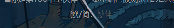

###### 具体实现方法：

1、首先，[点击这里](https://www.imatx.com/down/tw_cn.zip)右键另存下载简繁字体切换所需的tw_cn.js文件，我们把这个文件放到 `~/themes/next/source/js` 文件夹下。

**修改模板**，在我们想要显示简繁转换按钮的地方添加如下代码。例如，我在 NexT 主题的布局文件 `~/themes/next/layout/_partials/footer.swig` 里添加了如下代码：

````javas
<div class="translate-style">
繁/简：<a id="translateLink" href="javascript:translatePage();">繁体
</a>
</div>
<script type="text/javascript" src="/js/tw_cn.js"></script>
<script type="text/javascript">
var defaultEncoding = 2; //网站编写字体是否繁体，1-繁体，2-简体
var translateDelay = 0; //延迟时间,若不在前, 要设定延迟翻译时间, 如100表示100ms,默认为0
var cookieDomain = "https://tding.top/"; //Cookie地址, 一定要设定, 通常为你的网址
var msgToTraditionalChinese = "繁体"; //此处可以更改为你想要显示的文字
var msgToSimplifiedChinese = "简体"; //同上，但两处均不建议更改
var translateButtonId = "translateLink"; //默认互换id
translateInitilization();
</script>
````

读者可以在**博客底部点击简体 / 繁体**来看具体的切换字体效果。

#### 17、开启本地博客搜索功能

###### 效果图：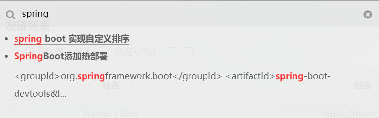

###### 具体实现方法：

提升读者用户体验，博客内肯定是需要一个全局搜索按钮的。当然hexo已经集成了几款开源的搜索插件，一般都使用的是 local_search。

搜索 local_search，设置代码如下：

````javas
# Local search
# Dependencies: https://github.com/theme-next/hexo-generator-searchdb
local_search:
  enable: true
  # if auto, trigger search by changing input
  # if manual, trigger search by pressing enter key or search button
  trigger: auto
  # show top n results per article, show all results by setting to -1
  top_n_per_article: 1
  # unescape html strings to the readable one
  unescape: false`
````

注意该搜索功能需要依赖 `hexo-generator-searchdb` 插件，依然还是使用命令 `npm install hexo-generator-searchdb --save` 来进行安装。然后 在 hexo 站点根目录配置文件 _config.xml 的末尾，加入以下代码即可。

````javs
search:
  path: search.xml
  field: post
  format: html
  limit: 10000
````

#### 18、设置侧栏阅读进度百分比

###### 具体实现方法：

编辑站点配置文件，修改 back2top 部分如下

````javas
back2top:
  enable: true
  sidebar: true
  scrollpercent: true
````

#### 19、文章置顶

###### 具体实现方法：

在站点目录的 node_modules/hexo-generator-index/lib/generator.js 中，把改文件的代码全改成：

````javas
'use strict';
var pagination = require('hexo-pagination');
module.exports = function(locals){
  var config = this.config;
  var posts = locals.posts;
    posts.data = posts.data.sort(function(a, b) {
        if(a.top && b.top) { // 两篇文章top都有定义
            if(a.top == b.top) return b.date - a.date; // 若top值一样则按照文章日期降序排
            else return b.top - a.top; // 否则按照top值降序排
        }
        else if(a.top && !b.top) { // 以下是只有一篇文章top有定义，那么将有top的排在前面（这里用异或操作居然不行233）
            return -1;
        }
        else if(!a.top && b.top) {
            return 1;
        }
        else return b.date - a.date; // 都没定义按照文章日期降序排
    });
  var paginationDir = config.pagination_dir || 'page';
  return pagination('', posts, {
    perPage: config.index_generator.per_page,
    layout: ['index', 'archive'],
    format: paginationDir + '/%d/',
    data: {
      __index: true
    }
  });
};
````

然后可以在博文模板post中加个top键，值为整数，并且值为大越靠前。

在主题目录中的themes\next\layout\_macro的post文件，打开查询第一个：post-meta。

````html
<div class="post-meta">
````

然后这个div的下一行添加上：

````javas

	<i class="fa fa-thumb-tack"></i>
	<font color=7D26CD>置顶</font>
	<span class="post-meta-divider">|</span>

````

#### 20、精品文章

###### 具体实现方法：

在 `/themes/next/layout/_macro/` 路径，找到 `post.swig` ，在前 `文置` 顶功能后边，加上如下代码：

````javas

     <span class="post-meta-item-icon">
         <i class="fa fa-newspaper-o jingping">精品</i>
     </span>
     <span class="post-meta-divider">|</span>
 
````

在 `themes/next/source/css/_custom/custom.styl` 中，增加如下样式：

````css
.jingping{
  background : #00a8c3;
  padding:2px 4px 2px 4px;
  color: #fff;
}
````

在需要设置精品的文章md文件中，加入如下代码：

````javas
essential: true
````

#### 21、博客加入canvas粒子时钟

###### 效果图：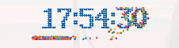

###### 具体实现方法：

它是一个可以和客户端同步的时钟，其特点是当时间走动时，数字将会散落成一个个粒子动画。

在 `/themes/next/layout/_custom/` 目录下，新建 `clock.swig` 文件，内容如下：

````html
<div id="">
  <canvas id="canvas" style="width:60%;">
</div>

<!--粒子时钟js-->
<script type="text/javascript" src="/js/src/canvas-dance-time.js"></script>
````

在 `/themes/next/layout/_macro/sidebar.swig` 中引入：

````javas

````

可根据自己的偏好来设置具体位置，我是加在了侧栏的末尾。

在 `/themes/next/source/js/src` 目录下，新建 `canvas-dance-time.js` 文件，内容如下：

````javas
(function(){
    var WINDOW_WIDTH = 820;
    var WINDOW_HEIGHT = 250;
    var RADIUS = 7; //球半径
    var NUMBER_GAP = 10; //数字之间的间隙
    var u=0.65; //碰撞能量损耗系数
    var context; //Canvas绘制上下文
    var balls = []; //存储彩色的小球
    const colors = ["#33B5E5","#0099CC","#AA66CC","#9933CC","#99CC00","#669900","#FFBB33","#FF8800","#FF4444","#CC0000"]; //彩色小球的颜色
    var currentNums = []; //屏幕显示的8个字符
    var digit =
        [
            [
                [0,0,1,1,1,0,0],
                [0,1,1,0,1,1,0],
                [1,1,0,0,0,1,1],
                [1,1,0,0,0,1,1],
                [1,1,0,0,0,1,1],
                [1,1,0,0,0,1,1],
                [1,1,0,0,0,1,1],
                [1,1,0,0,0,1,1],
                [0,1,1,0,1,1,0],
                [0,0,1,1,1,0,0]
            ],//0
            [
                [0,0,0,1,1,0,0],
                [0,1,1,1,1,0,0],
                [0,0,0,1,1,0,0],
                [0,0,0,1,1,0,0],
                [0,0,0,1,1,0,0],
                [0,0,0,1,1,0,0],
                [0,0,0,1,1,0,0],
                [0,0,0,1,1,0,0],
                [0,0,0,1,1,0,0],
                [1,1,1,1,1,1,1]
            ],//1
            [
                [0,1,1,1,1,1,0],
                [1,1,0,0,0,1,1],
                [0,0,0,0,0,1,1],
                [0,0,0,0,1,1,0],
                [0,0,0,1,1,0,0],
                [0,0,1,1,0,0,0],
                [0,1,1,0,0,0,0],
                [1,1,0,0,0,0,0],
                [1,1,0,0,0,1,1],
                [1,1,1,1,1,1,1]
            ],//2
            [
                [1,1,1,1,1,1,1],
                [0,0,0,0,0,1,1],
                [0,0,0,0,1,1,0],
                [0,0,0,1,1,0,0],
                [0,0,1,1,1,0,0],
                [0,0,0,0,1,1,0],
                [0,0,0,0,0,1,1],
                [0,0,0,0,0,1,1],
                [1,1,0,0,0,1,1],
                [0,1,1,1,1,1,0]
            ],//3
            [
                [0,0,0,0,1,1,0],
                [0,0,0,1,1,1,0],
                [0,0,1,1,1,1,0],
                [0,1,1,0,1,1,0],
                [1,1,0,0,1,1,0],
                [1,1,1,1,1,1,1],
                [0,0,0,0,1,1,0],
                [0,0,0,0,1,1,0],
                [0,0,0,0,1,1,0],
                [0,0,0,1,1,1,1]
            ],//4
            [
                [1,1,1,1,1,1,1],
                [1,1,0,0,0,0,0],
                [1,1,0,0,0,0,0],
                [1,1,1,1,1,1,0],
                [0,0,0,0,0,1,1],
                [0,0,0,0,0,1,1],
                [0,0,0,0,0,1,1],
                [0,0,0,0,0,1,1],
                [1,1,0,0,0,1,1],
                [0,1,1,1,1,1,0]
            ],//5
            [
                [0,0,0,0,1,1,0],
                [0,0,1,1,0,0,0],
                [0,1,1,0,0,0,0],
                [1,1,0,0,0,0,0],
                [1,1,0,1,1,1,0],
                [1,1,0,0,0,1,1],
                [1,1,0,0,0,1,1],
                [1,1,0,0,0,1,1],
                [1,1,0,0,0,1,1],
                [0,1,1,1,1,1,0]
            ],//6
            [
                [1,1,1,1,1,1,1],
                [1,1,0,0,0,1,1],
                [0,0,0,0,1,1,0],
                [0,0,0,0,1,1,0],
                [0,0,0,1,1,0,0],
                [0,0,0,1,1,0,0],
                [0,0,1,1,0,0,0],
                [0,0,1,1,0,0,0],
                [0,0,1,1,0,0,0],
                [0,0,1,1,0,0,0]
            ],//7
            [
                [0,1,1,1,1,1,0],
                [1,1,0,0,0,1,1],
                [1,1,0,0,0,1,1],
                [1,1,0,0,0,1,1],
                [0,1,1,1,1,1,0],
                [1,1,0,0,0,1,1],
                [1,1,0,0,0,1,1],
                [1,1,0,0,0,1,1],
                [1,1,0,0,0,1,1],
                [0,1,1,1,1,1,0]
            ],//8
            [
                [0,1,1,1,1,1,0],
                [1,1,0,0,0,1,1],
                [1,1,0,0,0,1,1],
                [1,1,0,0,0,1,1],
                [0,1,1,1,0,1,1],
                [0,0,0,0,0,1,1],
                [0,0,0,0,0,1,1],
                [0,0,0,0,1,1,0],
                [0,0,0,1,1,0,0],
                [0,1,1,0,0,0,0]
            ],//9
            [
                [0,0,0,0],
                [0,0,0,0],
                [0,1,1,0],
                [0,1,1,0],
                [0,0,0,0],
                [0,0,0,0],
                [0,1,1,0],
                [0,1,1,0],
                [0,0,0,0],
                [0,0,0,0]
            ]//:
        ];

    function drawDatetime(cxt){
        var nums = [];

        context.fillStyle="#005eac"
        var date = new Date();
        var offsetX = 70, offsetY = 30;
        var hours = date.getHours();
        var num1 = Math.floor(hours/10);
        var num2 = hours%10;
        nums.push({num: num1});
        nums.push({num: num2});
        nums.push({num: 10}); //冒号
        var minutes = date.getMinutes();
        var num1 = Math.floor(minutes/10);
        var num2 = minutes%10;
        nums.push({num: num1});
        nums.push({num: num2});
        nums.push({num: 10}); //冒号
        var seconds = date.getSeconds();
        var num1 = Math.floor(seconds/10);
        var num2 = seconds%10;
        nums.push({num: num1});
        nums.push({num: num2});

        for(var x = 0;x<nums.length;x++){
            nums[x].offsetX = offsetX;
            offsetX = drawSingleNumber(offsetX,offsetY, nums[x].num,cxt);
            //两个数字连一块，应该间隔一些距离
            if(x<nums.length-1){
                if((nums[x].num!=10) &&(nums[x+1].num!=10)){
                    offsetX+=NUMBER_GAP;
                }
            }
        }

        //说明这是初始化
        if(currentNums.length ==0){
            currentNums = nums;
        }else{
            //进行比较
            for(var index = 0;index<currentNums.length;index++){
                if(currentNums[index].num!=nums[index].num){
                    //不一样时，添加彩色小球
                    addBalls(nums[index]);
                    currentNums[index].num=nums[index].num;
                }
            }
        }
        renderBalls(cxt);
        updateBalls();

        return date;
    }

    function addBalls (item) {
        var num = item.num;
        var numMatrix = digit[num];
        for(var y = 0;y<numMatrix.length;y++){
            for(var x = 0;x<numMatrix[y].length;x++){
                if(numMatrix[y][x]==1){
                    var ball={
                        offsetX:item.offsetX+RADIUS+RADIUS*2*x,
                        offsetY:30+RADIUS+RADIUS*2*y,
                        color:colors[Math.floor(Math.random()*colors.length)],
                        g:1.5+Math.random(),
                        vx:Math.pow(-1, Math.ceil(Math.random()*10))*4+Math.random(),
                        vy:-5
                    }
                    balls.push(ball);
                }
            }
        }
    }

    function renderBalls(cxt){
        for(var index = 0;index<balls.length;index++){
            cxt.beginPath();
            cxt.fillStyle=balls[index].color;
            cxt.arc(balls[index].offsetX, balls[index].offsetY, RADIUS, 0, 2*Math.PI);
            cxt.fill();
        }
    }

    function updateBalls () {
        var i =0;
        for(var index = 0;index<balls.length;index++){
            var ball = balls[index];
            ball.offsetX += ball.vx;
            ball.offsetY += ball.vy;
            ball.vy+=ball.g;
            if(ball.offsetY > (WINDOW_HEIGHT-RADIUS)){
                ball.offsetY= WINDOW_HEIGHT-RADIUS;
                ball.vy=-ball.vy*u;
            }
            if(ball.offsetX>RADIUS&&ball.offsetX<(WINDOW_WIDTH-RADIUS)){

                balls[i]=balls[index];
                i++;
            }
        }
        //去除出边界的球
        for(;i<balls.length;i++){
            balls.pop();
        }
    }
    function drawSingleNumber(offsetX, offsetY, num, cxt){
        var numMatrix = digit[num];
        for(var y = 0;y<numMatrix.length;y++){
            for(var x = 0;x<numMatrix[y].length;x++){
                if(numMatrix[y][x]==1){
                    cxt.beginPath();
                    cxt.arc(offsetX+RADIUS+RADIUS*2*x,offsetY+RADIUS+RADIUS*2*y,RADIUS,0,2*Math.PI);
                    cxt.fill();
                }
            }
        }
        cxt.beginPath();
        offsetX += numMatrix[0].length*RADIUS*2;
        return offsetX;
    }

    var canvas = document.getElementById("canvas");
    canvas.width=WINDOW_WIDTH;
    canvas.height=WINDOW_HEIGHT;
    context = canvas.getContext("2d");

    //记录当前绘制的时刻
    var currentDate = new Date();

    setInterval(function(){
        //清空整个Canvas，重新绘制内容
        context.clearRect(0, 0, context.canvas.width, context.canvas.height);
        drawDatetime(context);
    }, 50)
})();
````

#### 22、为站点添加标题崩溃特效

> 该特效为：当用户离开站点相关的页面时，网页的标题会变成已崩溃，网站图标也会改变；当用户重新回到站点页面时才会恢复正常。

###### 具体实现方法：

在 `/themes/next/source/js/src/` 目录下新建 `crash_cheat.js` ，代码如下：

````javas
$(window).load(function () {
//整合页面欺骗特效 window.onload有冲突
    var OriginTitile = document.title;
    var titleTime;
    document.addEventListener('visibilitychange', function () {
        if (document.hidden) {
            $('[rel="icon"]').attr('href', "../../images/failure.png");
            $('[rel="shortcut icon"]').attr('href', "../../images/failure.png");
            document.title = '(つェ⊂) 我藏好了哦~ ';
            clearTimeout(titleTime);
        } else {
            $('[rel="icon"]').attr('href', "../../images/favicon.png");
            $('[rel="shortcut icon"]').attr('href', "../../images/favicon.png");
            document.title = 'o(^▽^)o 被你发现啦~ ';
            titleTime = setTimeout(function () {
                document.title = OriginTitile;
            }, 2000);
        }
    });
});
````

在 `/themes/next/layout/_layout.swig` 文件末尾，添加引用：

````javas
<!--崩溃欺骗-->
<script type="text/javascript" src="/js/src/crash_cheat.js"></script>
````

上面的图片放在 `/themes/next/source/images/` 目录下，自行选择喜欢的图片即可。

#### 23、添加valine评论系统

###### 效果图：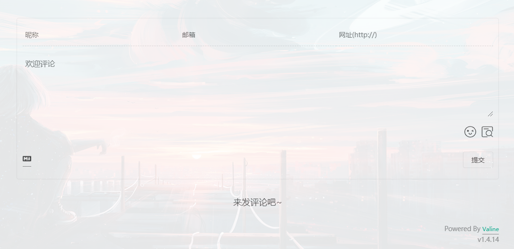

###### 具体实现方法：

没有评论系统的博客是没有灵魂的，不仅如此，当前免费开源的评论系统中，valine 因为简洁并且支持匿名留言得到很多博主的喜爱，而像其它的来必力（韩国的）、Gitalk（Github的）等都有这样那样的缺点，不太建议使用。

需要注意的是valine后台评论保存是依赖于 leancloud的，leancloud 是一个面向个人用户免费的存储系统（当然不止是提供存储功能，还有其它服务），我们需要在 leancloud 官网注册，具体步骤可以看[valine的官方文档](https://valine.js.org/)介绍。

搜索 valine，找到如下配置：

````javas
valine:		#评论功能
  enable: true		#开关
  appid: 	#自己的appid
  appkey: #自己的appkey
  notify: false # Mail notifier
  verify: false # Verification code
  placeholder: 欢迎评论 # Comment box placeholder
  avatar: wavatar # Gravatar style
  guest_info: nick,mail,link # Custom comment header
  pageSize: 10 # Pagination size
  language: # Language, available values: en, zh-cn
  visitor: true # Article reading statistic 阅读次数
  comment_count: true # If false, comment count will only be displayed in post page, not in home page
  recordIP: false # Whether to record the commenter IP
  serverURLs: # When the custom domain name is enabled, fill it in here (it will be detected automatically by default, no need to fill in)
  #post_meta_order: 0
````

注意由于 valine 依赖于 leancloud 存储服务，因此要先去 [https://leancloud.cn](https://leancloud.cn/) 网站注册，获取到 appid 和 appkey 后放到这里就 ok 了。其中 avatar 是设置默认头像，可以去 https://valine.js.org/avatar 选择默认头像，然后在这里设置名字即可。具体使用可以参考[valine的官方文档](https://valine.js.org/)。

#### 24、用LeanClound给hexo+next博客添加文章阅读数

###### 具体实现方法：

由于已经使用了valine评论系统，只需要在进行小小的改动，就能实现此功能

登录到LeanClound，找到上次创建的应用，新建一个Class

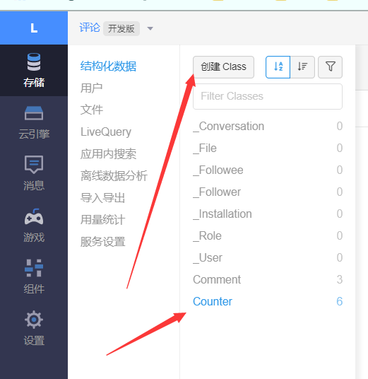

此处的新建Class名字必须为`Counter`:

#### 25、博主头像圆形并旋转

###### 具体实现方法：

在之前的版本里面得自定义才能达到，现在已经可以直接配置了。

打开主题配置 _config.yml 文件，搜索关键词 `avatar:` 修改相应配置即可。

````javas
# Sidebar Avatar
avatar:
  # Replace the default image and set the url here.
  url: /images/avatar.png
  # If true, the avatar will be dispalyed in circle.
  rounded: true		#开启后，头像为圆形
  # If true, the avatar will be rotated with the cursor.
  rotated: true		#开启后，头像获得光标时旋转
````


###### 未完待续。。。