<div class="snote done"><p>本笔记根据B站 遇见狂神说的MyBatis-Plus视频整理</p></div>

**视频链接：**https://www.bilibili.com/video/BV17E411N7KN

### 快速入门

使用SpringBoot初始化快速构建

**导入依赖**

```xml
<!--数据库驱动-->
        <dependency>
            <groupId>mysql</groupId>
            <artifactId>mysql-connector-java</artifactId>
        </dependency>

<!--lombok-->
        <dependency>
            <groupId>org.projectlombok</groupId>
            <artifactId>lombok</artifactId>
        </dependency>

<!--mybatis-plus-->
        <dependency>
            <groupId>com.baomidou</groupId>
            <artifactId>mybatis-plus-boot-starter</artifactId>
            <version>3.0.5</version>
        </dependency>
```

说明：我们使用mybatis-plus可以节省我们大量的代码，尽量不要同时导入mybatis和mybatis-plus

**连接数据库**

```properties
# mysql 5 驱动不同   com.mysql.jdbc.Driver
# mysql 8 驱动不同   com.mysql.cj.jdbc.Driver 、 需要增加时区的配置   serverTimezone=GMT%2B8
spring.datasource.username=root
spring.datasource.password=root
spring.datasource.url= jdbc:mysql://localhost:3306/mybatis_plus?useSSL=false&useUnicode=true&characterEncoding=utf-8&serverTimezone=GMT%2B8
spring.datasource.driver-class-name=com.mysql.cj.jdbc.Driver
```

`传统方式：pojo-dao（连接mybatis，配置mapperxml文件）-service  controller`

**使用了mybatis-plus之后**

1. pojo

   ```java
   @Data
   @NoArgsConstructor
   @AllArgsConstructor
   public class User {
   
       //对应数据库中的主键（uuid，自增id、雪花算法，redis）
       private Long id;
   
       private String name;
   
       private Integer age;
   
       private String email;
   }
   
   ```

2. mapper接口

   ````java
   // 在对应的mapper上面继承基本的接口
   @Mapper
   @Repository
   public interface UserMapper extends BaseMapper<User> {
   
       // 所有的CRUD操作都已经编写完成了，
       // 不需要像以前的配置一大堆文件了
   }
   ````

   注意点：需要在启动类上加入一个注解  `@MapperScan("com.jinan.mapper")`，用来扫描我们的mapper文件夹

3. 使用，在测试类中测试

   ````java
   //继承了BaseMapper，所有的方法都来自父类
       //我们也可以继续编写自己的扩展方法
       @Autowired
       private UserMapper userMapper;
   
       @Test
       void contextLoads() {
           //参数是一个 Wrapper，条件构造器，这里我们先不用  null
           //查询全部方法
           List<User> users = userMapper.selectList(null);
           users.forEach(System.out::println);
       }
   ````

- 结果

  ```code
  User(id=1, name=张三, age=18, email=11@qq.com)
  User(id=2, name=李四, age=18, email=11@qq.com)
  User(id=3, name=王五, age=12, email=11@qq.com)
  User(id=4, name=孙六, age=13, email=11@qq.com)
  ```

  > 思考问题？

1、SQL谁帮我们写的？ MyBatis-Plus

2、方法哪里来的？  MyBatis-Plus

### 配置日志

我们所有的SQL现在都是不可见的，我们希望知道它是怎么执行的，所以我们必须要有日志！

```properties
#配置日志
mybatis-plus.configuration.log-impl=org.apache.ibatis.logging.stdout.StdOutImpl
```

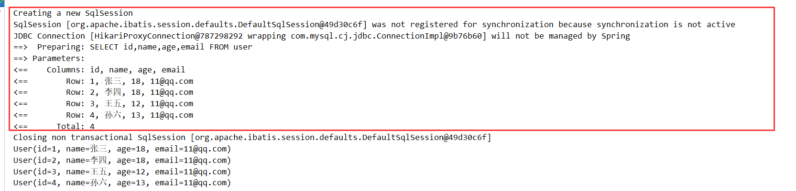

配置完日志之后，后面的学习就需要注意这个自动生成的SQL。

### CRUD扩展

#### 插入操作

>  insert 插入

```java
    // 测试插入
    @Test
    public void testInsert(){
        User user = new User();
        user.setName("测试");
        user.setAge(20);
        user.setEmail("22@qq.com");

        int insert = userMapper.insert(user);
        System.out.println(insert); //受影响的行数
        System.out.println(user); //id会自动回填
    }
```

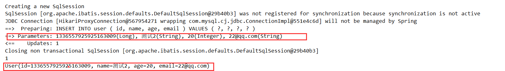

> 数据库插入的id的默认值为：全局的唯一id

#### 主键生成策略

> 默认  ID_WORKER  全局唯一ID

分布式系统唯一id生成：https://www.cnblogs.com/haoxinyue/p/5208136.html

雪花算法：

snowflake是Twitter开源的分布式ID生成算法，结果是一个long型的ID。其核心思想是：使用41bit作为毫秒数，10bit作为机器的ID（5个bit是数据中心，5个bit的机器ID），12bit作为毫秒内的流水号（意味着每个节点在每毫秒可以产生 4096 个 ID），最后还有一个符号位，永远是0

> 主键自增  AUTO

我们需要配置主键自增：

1、实体类字段上==@TableId(type = IdType.AUTO)==

2、数据库字段一定要是自增的！

3、重新测试即可

> 其余的源码解释

```java
public enum IdType{
AUTO, //数据库id自增
NONE, //未设置主键
INPUT, //手动输入  必须要自己配置id
ID_WORKER, //默认的全局唯一 id
UUID, //全局唯一id
ID_WORKER_STR;  // ID_WORKER 字符串表示法
}
```

#### 更新操作

```java
 //测试更新
    @Test
    public void testUpdate(){
        User user = new User();
        //通过条件，自动拼接动态SQL
        user.setId(5L);
        user.setName("振续来也");
        user.setAge(99);

        // 注意： updateById 但是参数是一个对象
        int i = userMapper.updateById(user);
        System.out.println(i);
    }
```

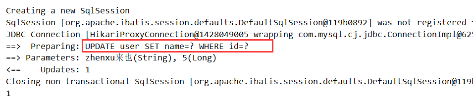

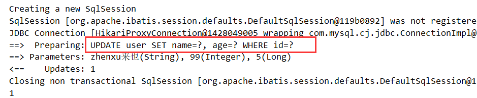

所有的SQL自动给你动态配置

#### 自动填充

创建时间、修改时间！这些操作一般都是自动化完成的，我们不希望手动更新！

阿里巴巴开发手册：所有的数据库表：gmt_create、gmt_modified几乎所有的表都要配置上，而且需要自动化

> 方式一：数据库级别（工作中不允许你修改数据库）

1、在表中新增字段 create_time、update_time

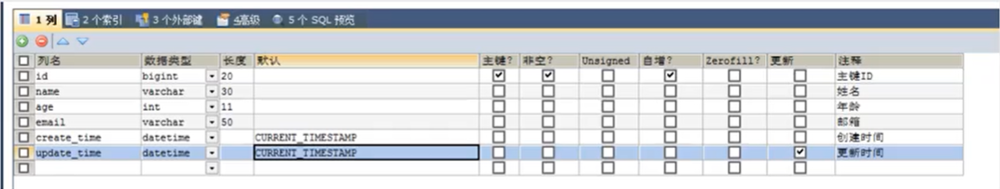

2、添加对应实体类

```java
    private Date createTime;
    private Date updateTime;
```

3、测试查看

> 方式二：代码级别

1、删除数据库的默认值，更新操作！

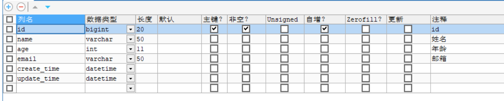

2、实体类的字段属性上需要增加注解

```java
    @TableField(fill = FieldFill.INSERT)
    private Date createTime;

    @TableField(fill = FieldFill.INSERT_UPDATE)
    private Date updateTime;
```

3、编写处理器来处理这个注解即可！

```java
@Slf4j
@Component //一定不要忘记把处理器加到IOC容器中
public class MyDataHandler implements MetaObjectHandler {
    // 插入时候的填充策略
    @Override
    public void insertFill(MetaObject metaObject) {
        log.info("开始插入");
        //String fieldName, java.lang.Object fieldVal, org.apache.ibatis.reflection.MetaObject metaObject
        this.setFieldValByName("createTime",new Date(),metaObject);
        this.setFieldValByName("updateTime",new Date(),metaObject);
    }

    //更新时候的填充策略
    @Override
    public void updateFill(MetaObject metaObject) {
        log.info("开始更新");
        this.setFieldValByName("updateTime",new Date(),metaObject);
    }
}
```

4、测试插入

5、测试更新 观察时间变化即可

#### 乐观锁

在面试过程中，我们经常会被问到乐观锁，悲观锁！这个其实非常简单

> 乐观锁：顾名思义，十分乐观，它总是认为不会出现问题，无论干什么都不去上锁！如果出现了问题，再次更新值进行测试！
>
> 
>
> 悲观锁：顾名思义，十分悲观，它总是认为出现问题，无论干什么都会上锁！再去操作！

version、new version

**乐观锁机制**

> 当要更新一条记录的时候，希望这条记录没有被别人更新
> 乐观锁实现方式：

- 取出记录时，获取当前version
- 更新时，带上这个version
- 执行更新时， set version = newVersion where version = oldVersion
- 如果version不对，就更新失败

```sql
乐观锁：1、先查询，获得版本号 version = 1
-- A
    update user set name = "jinna",version = version + 1
    where id = 2 and version =1
    
-- B 线程抢先完成，这个时候， version= 2 会导致A修改失败
    update user set name = "jinna",version = version + 1
    where id = 2 and version =1
```

> 测试mybatis-plus的乐观锁插件

1、给数据库增加version字段

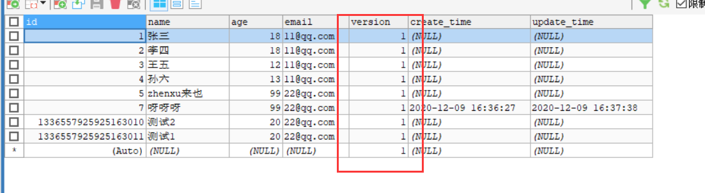

2、实体类加对应的字段

```java
    @Version //乐观锁注解
    private Integer version;
```

3、注册组件

```java
// 扫描我们的mapper文件夹
@MapperScan("com.jinan.mapper")
@EnableTransactionManagement  //自动管理事务
@Configuration //配置类
public class MyBatisPlusConfig {

    // 注册乐观锁插件
    @Bean
    public OptimisticLockerInterceptor optimisticLockerInterceptor(){
        return new OptimisticLockerInterceptor();
    }
}
```

4、测试一下

```java
//测试乐观锁成功
    @Test
    public void testOptimisticLocker(){
        //查询用户信息
        User user = userMapper.selectById(1L);
        //修改用户信息
        user.setName("乐观锁");
        //执行更新操作
        userMapper.updateById(user);
    }


    //测试乐观锁失败  多次按下下
    @Test
    public void testOptimisticLocker2(){
        //线程1
        User user = userMapper.selectById(1L);
        user.setName("乐观锁");

        //线程2  模拟另外一个线程执行了插队操作
        User user1 = userMapper.selectById(1L);
        user.setName("啦啦啦");


        // 自旋锁来多次尝试提交
        userMapper.updateById(user); // 如果没有乐观锁就会覆盖插队线程的值！
        userMapper.updateById(user1);
    }
```


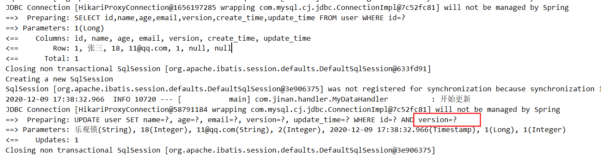

**多线程下**

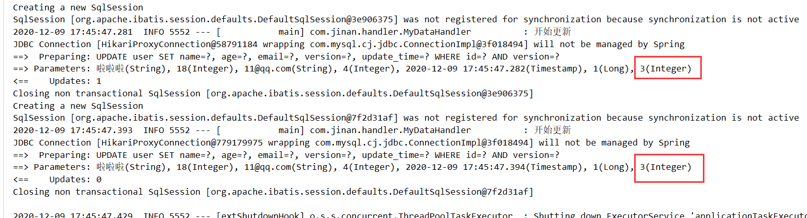

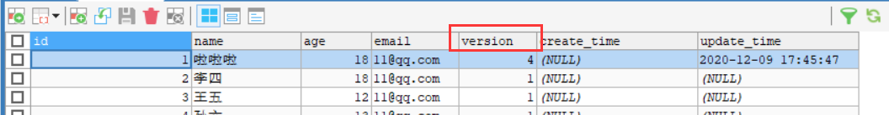


#### 查询操作

```java
    // 测试查询  根据id单个查询
    @Test
    public void testSelectById(){
        User user = userMapper.selectById(1L);
        System.out.println(user);
    }

    //测试批量查询   根据id 多个查询   SelectByBatchId()
    @Test
    public void testSelectByBatchId(){
        List<User> users = userMapper.selectBatchIds(Arrays.asList(1, 2, 3));
        users.forEach(System.out::println);
    }

    //按条件查询  map
    @Test
    public void testSelectByBatchIds(){
        HashMap<String, Object> map = new HashMap<>();
        //自定义查询条件
        map.put("name","啦啦啦");

        List<User> users = userMapper.selectByMap(map);
        users.forEach(System.out::println);
    }
```

#### 分页查询

分页使用十分多

1、原始的limit进行分页

2、pageHelper 第三方插件

3、mybatis-plus内置了分页插件

> 如何使用

1、配置拦截器组件 ，官网有示例

```java
    //分页插件
    @Bean
    public PaginationInterceptor paginationInterceptor() {
        return new PaginationInterceptor();
    }
```

2、测试

```java
//测试分页查询
    @Test
    public void testPage(){
        //参数一 ：当前页
        // 参数二 ：显示条数
        Page<User> Page = new Page<>(2,5);
        userMapper.selectPage(Page,null);

        //结果
        Page.getRecords().forEach(System.out::println);
        System.out.println(Page.getTotal());    //总条数
    }
```

#### 删除操作

基本的删除

```java
//删除  单个删除
@Test
public void testDeleteById(){
    userMapper.deleteById(1L);
}

//批量删除
@Test
public void testDeleteBatchIds(){
    userMapper.deleteBatchIds(Arrays.asList(1,2,3));
}

//根据条件删除  map
@Test
public void testDeleteMap(){
    HashMap<String, Object> map = new HashMap<>();
    map.put("name","啦啦啦");
    userMapper.deleteByMap(map);
}
```

我们在工作中会遇到一些问题：逻辑删除！

#### 逻辑删除

> 物理删除：从数据库中直接移除
>
> 逻辑删除：在数据库中没有被移除，而是通过一个变量来让他失效！ deleted = 0 ----》 deleted = 1

管理员可以查看被删除的记录！防止数据的丢失，类似于回收站

**测试**

1、在数据库表中增加一个 `deleted` 字段

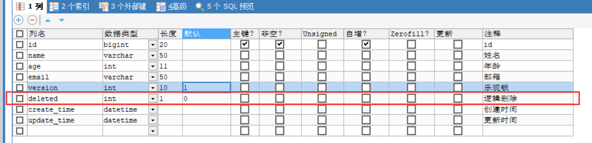

2、补充实体类

```java
    //逻辑删除注解
    @TableLogic
    private Integer deleted;
```

3、配置

```java
//在config中加入
@Bean
public ISqlInjector sqlInjector(){
    return new LogicSqlInjector();
}
```

`application.properties`

```pro
#配置逻辑删除
mybatis-plus.global-config.db-config.logic-delete-value=1
mybatis-plus.global-config.db-config.logic-not-delete-value=0
```

4、测试删除

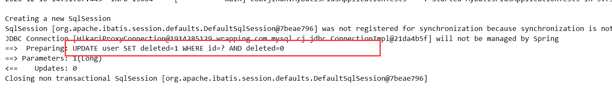

执行的其实是更新操作，记录依旧在数据库中，但是值已经变化了

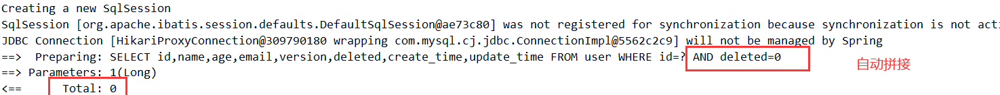

查询的时候回自动过滤被逻辑删除的数据

以上的所有CRUD操作及其扩展操作，必须精通，会大大的提高效率

#### 性能分析插件

我们在平时的开发中，会遇到一些慢SQL。

mybatis-plus也提供了性能分析插件，如果超过这个时间就会停止运行！

新版本移除了性能分析插件，可以使用一个新的插件

官方文档：https://mybatis.plus/guide/p6spy.html

#### 条件构造器

十分重要：Wrapper

官方文档：https://mybatis.plus/guide/wrapper.html#abstractwrapper

1、测试一：

```java
@Test
void contextLoads() {

    //查询name不为空的用户，并且邮箱不为空的用户
    QueryWrapper<User> wrapper = new QueryWrapper<>();
    wrapper
        .isNotNull("name")
        .isNotNull("email");

    userMapper.selectList(wrapper).forEach(System.out::println); //和map对比一下
}
```

2、测试二：

```java
    @Test
    public void test2() {
        //查询名字等于王五的，
        QueryWrapper<User> wrapper = new QueryWrapper<>();
        wrapper.eq("name", "王五");
        User user = userMapper.selectOne(wrapper);  //查询一个用户，多个结果使用 list 或map
        System.out.println(user);
    }
```

3、测试三：

```java
    @Test
    void test3() {
        //查询年龄在 12  -- 26之间的用户
        QueryWrapper<User> wrapper = new QueryWrapper<>();
        wrapper.between("age", 12, 26);
        Integer integer = userMapper.selectCount(wrapper);
        System.out.println(integer);
    }
```

4、测试四：

```java
    //模糊查询
    @Test
    void test4(){
        QueryWrapper<User> wrapper = new QueryWrapper<>();
        //左 和 右  %E%
        wrapper
                .notLike("name","呀")
                .likeRight("email","2");
        List<Map<String, Object>> maps = userMapper.selectMaps(wrapper);
        maps.forEach(System.out::println);
    }
```

5、测试五：

```java
    @Test
    void test5(){
        QueryWrapper<User> wrapper = new QueryWrapper<>();
        //id 在子查询中查出来
        wrapper.inSql("id","select id from user where id < 3");
        List<Object> objects = userMapper.selectObjs(wrapper);
        objects.forEach(System.out::println);
    }
```

6、测试六

```java
    @Test
    void test6() {
        QueryWrapper<User> wrapper = new QueryWrapper<>();
        //通过 id 进行排序
        wrapper.orderByDesc("id");
        List<User> users = userMapper.selectList(wrapper);
        users.forEach(System.out::println);
    }
```