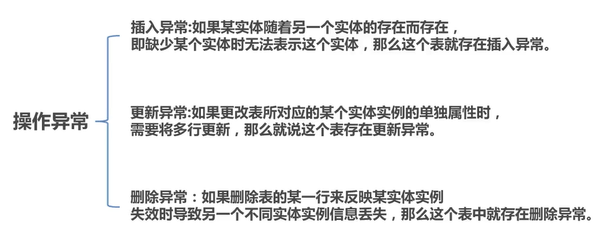
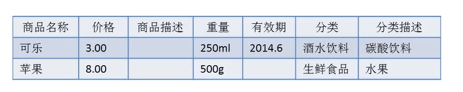
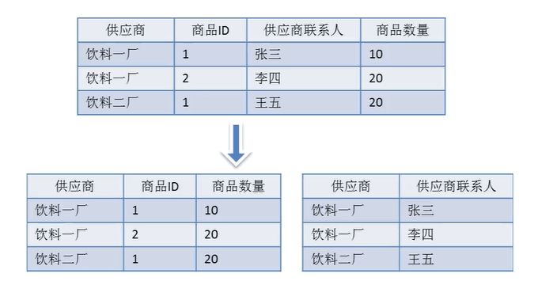
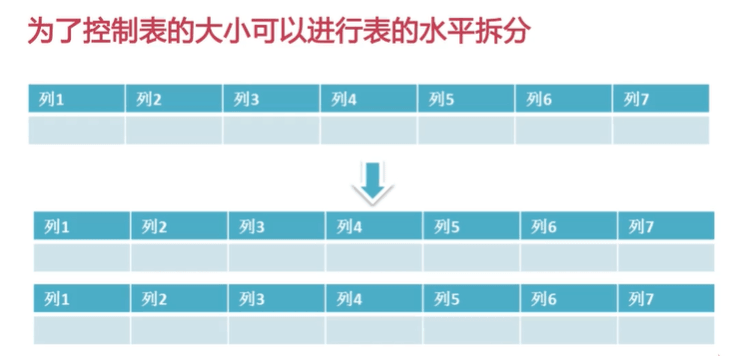

> 关于数据库设计的一些知识点

<!--more-->

### 什么是数据库设计？

简单来说,数据库设计就是根据业务系统的具体需要,结合我们所选用的DBMS(数据库管理系统) ,为这个业务系统构造出最优的数据存储模型。并建立好数据库中的表结构及表与表之间的关联关系的过程。使之能**有效的**对应用系统中的数据进行**存储**,并可以**高效的**对已经存储的数据进行**访问**

### 为什么要进行数据库设计？

| 优良的设计       | 糟糕的设计                   |
| ---------------- | ---------------------------- |
| 减少数据冗余     | 存在大量数据冗余             |
| 避免数据维护异常 | 存在数据插入，更新，删除异常 |
| 节约存储空间     | 浪费大量存储空间             |
| 高效的访问       | 访问数据低效                 |

### 设计步骤

需求分析———逻辑设计———物理设计———维护优化

###  为什么要进行需求分析？

1. 了解系统中所要存储的数据
2. 了解数据的存储特点
3. 了解数据的生命周期

### 要搞清楚的一些问题

1. 实体及实体之间的关系（一对一，一对多，多对对）
2. 实体所包含的属性有什么？
3. 那些属性或属性的组合可以唯一标识一个实体

### 
实例演示

以一个小型的电子商务网站为例，在这个电子商务网站的系统中包含了几个核心模块：**用户模块**，**商品模块**，**订单模块**，**购物车模块**，**供应商模块**。

#### 用户模块

#### 商品模块

#### 订单模块

#### 购物车模块

#### 供应商模块

#### 各模块之间的关系

#### 实体之间的关系

### 逻辑设计是做什么的

1. 将需求转化为数据库的逻辑模型
2. 通过ER图的形式对逻辑模型进行展示
3. 同所选用的具体的DBMS系统无关

#### 名词解释

#### ER图例说明

------

### 设计范式概要

常见数据库设计范式包括：

第一范式，第二范式，第三范式及BC范式，当然还有第四以及第五范式，不过这里我们把重点放到前三个范式上，这也是目前我们大多数数据库设计要遵循的范式。

### 数据操作异常及数据冗余

#### 数据操作异常

#### 数据冗余

数据冗余是指相同的数据在多个地方存在，或者说表中的某个列可以由其他列进行计算得到，这样就说表中存在数据冗余。

### 第一范式

**定义：**数据库表中的所有字段都是单一属性，不可再分的。

这个单一属性是由基本的数据类型所构成的，如整数，浮点数，字符串

**换句话说**   **第一范式要求数据库中的表都是二维表**

### 第二范式

**定义：**数据库的表中不存在非关键字段对任一候选关键字段的部分函数依赖。

部分函数依赖是指存在着组合关键字中的任一关键字决定非关键字的情况

**换句话说** **所有单关键字段的表都符合第二范式**

由于供应商和商品之间是多对多的关系

所以只有使用商品名称和供应商名称才可以唯一标识出一件商品

也就是商品名称和供应商名称是一组组合关键字。

上表中存在以下的部分函数依赖关系

（商品名称）——>（价格，描述，重量，商品有效期）

（供应商名称）——>（供应商电话）

#### 存在的问题

1. 插入异常
2. 删除异常
3. 更新异常
4. 数据冗余

#### 解决

新建一张表

### 第三范式

定义：

第三范式实在第二范式的基础上定义的，如果数据表中不存在非关键字段，对任意候选关键字段的传递函数依赖则符合第三范式

存在以下转递函数依赖关系：

（商品名称）——>（分类）——>（分类描述）

也就是说存在非关键字段   "分类描述"

对关键字段  "商品名称"  的传递函数依赖

#### 存在的问题

（分类，分类描述）对于每一个商品都会进行记录，所以存在着数据冗余。同时也还存在数据的插入，更新及删除异常。

#### 解决

### BC范式

**定义:**

在第三范式的基础之上,数据库表中如果不存在任何字段对任一候选关键字段的传递函数依赖则附合BC范式。也就是说如果是复合关键字,则复合关键字之间也不能存在函数依赖关系。

**假定：**

供应商联系人只能受雇于一家供应商，每家供应商可以供应多个商品则存在如下决定关系：

（供应商，商品ID）——>（联系人，商品数量）

（联系人，供应商）——>（供应商，商品数量）

**存在下列关系因此不符合要求**

（供应商）——>（供应商联系人）

（供应商联系人）——>（供应商）

并且存在数据操作异常及数据冗余

#### 解决

使用拆表的方式

### 数据库物理设计要做什么？

1. 选择合适的数据库管理系统
2. 定义数据库、表及字段的命名规范
3. 根据所选的DBMS系统选择合适的字段类型
4. 反范式化设计

#### 选择合适的数据库

### MySQL常用的存储引擎

| 存储引擎    | 事务   | 锁粒度               | 主要应用                       | 忌用                     |
| ----------- | ------ | -------------------- | ------------------------------ | ------------------------ |
| MyISAM      | 不支持 | 支持并发插入的表级锁 | SELECT，INSERT                 | 读写操作频繁             |
| MRG_MYISAM  | 不支持 | 支持并发插入的表级锁 | 分段归档，数据仓库             | 全局查找过多的场景       |
| Innodb      | 支持   | 支持MVCC的行级锁     | 事务处理                       | 无                       |
| Archive     | 不支持 | 行级锁               | 日志记录，值支持insert，select | 需要随机读取，更新，删除 |
| Ndb cluster | 支持   | 行级锁               | 高可用性                       | 大部分应用               |

### 表及字段的命名规则

**所有对象命名应该遵循下述规则：**

1. **可读性原则**

   使用大写和小写来格式化的库对象名字以获得良好的可读性。

   例如：使用CustAddress而不是custaddress来提高可读性。（这里要注意有些DBMS系统对表明的大小写是敏感的）

2. **表意性原则**

   对象的名字应该能够描述它所标识的对象。

   例如：对于表，表的名称应该能够体现表中存储的数据内容；对于存储过程，存储过程应该能够体现存储过程的功能。

3. **长名原则**

   尽可能少使用或者不使用缩写，适用于数据库（DATABASE）名之外的任一对象

| FullName | Sex  | birthday   | Address |
| -------- | ---- | ---------- | ------- |
| 张三     | 男   | 1978-03-01 | 北京市  |

### 数据库字段类型选择原则

列的数据类型一方面影响数据存储空间的开销，另一方面也会影响数据查询性能。当一个列可以选择多种数据类型时，**应该优先考虑**数字类型，**其次是**日期或者二进制类，**最后是**字符类型。对于**相同级别**的数据类型，应该**优先选择**占用空间小的数据类型。

#### 各个类型的占用空间

**以上选择原则主要是从下面两个角度考虑：**

1. 在对数据进行比较（查询条件，join条件及排序）操作时：

   **同样的数据，字符处理往往比数字处理慢。**

2. 在数据库中，数据处理以页为单位，**列的长度越小，利于性能提升。**

#### char与varchar如何选择

**原则：**

1. 如果列中要存储的数据长度差不多是一致的， 则应该考虑用char，否则应该考虑用varchar。

2. 如果列中的最大数据长度小于50Byte，则一般也考虑用char。

   （当然，如果这个列很少用，则给予节省空间和减少 I/O 的考虑，还是可以选择用varchar）

3. 一般不宜定义大于50Byte的char类型列

### decimal和float如何选择

**原则：**

1. decimal用于存储精确数据，而float只能用于存储非精确数据。故精确数据只能选择用decimal类型。
2. 由于float的存储空间开销一般比decimal小（精确到7位小数只需要4个字节，而精确到15位小数只需要8个字节），故非精确数据优先选择float类型。

### 时间类型如何存储

1. **使用 int 来存储时间字段的优缺点**

   优点：字段长度比datatime小。

   缺点：使用不方便，要进行函数转换。 

   限制：只能存储到 2038-1-19  11: 14:07 即2^32为 2147483648

2. **需要存储的时间粒度**

   年   月   日   小时  分  秒   周 

### 数据库设计其他注意事项

------

### 如何选择主键

1. **区分业务主键和数据库主键**

   业务主键用于标识业务数据，进行表与表之间的关联；

   数据库主键为了优化数据存储（Innodb会生成6个字节的隐含主键）

2. **根据数据库的类型，考虑主键是否要顺序增长**

   有些数据库是按主键的顺序逻辑存储的

3. **主键的字段类型所占用空间要尽可能的小**

   对于使用聚集索引方式存储的表，每个索引后都会附加主键信息。

------

### 避免使用外键约束

1. 降低数据导入的效率
2. 增加维护成本
3. 虽然不建议使用外键约束，但是相关联的列上一定要索引

------

### 避免使用触发器

1. 降低数据导入的效率
2. 可能会出现意想不到的数据异常
3. 使业务逻辑变的复杂

------

### 关于预留字段

1. 无法准确的知道预留字段的类型
2. 无法准确的知道预留字段中所存储的内容
3. 后期维护预留字段所要的成本，同增加一个字段所需要的成本是相同的
4. **严禁**使用预留字段

------

### 什么是反范式化

**反范式化**是针对范式化而言的，所谓的反范式化就是为了**性能**和**读取效率**的考虑而适当的对第三范式的要求进行**违反**，而允许存在少量的数据冗余，换句话来说，反范式化就是使用空间来换取时间。

### 为什么反范式化

1. 减少表的关联数量
2. 增加数据的读取效率
3. 反范式化一定要适度

#### 例子

查询的时候较为复杂

**反范式化之后**

### 数据库维护和优化要做什么

1. 维护数据字典
2. 维护索引
3. 维护表结构
4. 在适当的时候对表进行水平高拆分或垂直拆分

### 数据库如何维护数据字典

1. 使用第三方工具对数据字典进行维护
2. 利用数据库本身的备注字段来维护数据字典。以MySQL为例
3. 导出数据字典

### 数据库如何维护索引

#### 如何选择合适的列建立索引？

1. 出现在  where 从句，  group by  从句， order by 从句中的列
2. 可选择性高德列要放在索引的前面
3. 索引中不要包含太长的数据类型

#### 注意事项

1. 索引并不是越多越好，过多的索引不但会降低写效率，而且会降低读的效率
2. 定期维护索引碎片
3. 在SQL语句中不要使用强制索引关键字

### 数据库如何维护表结构

#### 注意事项

1. 使用在线变更表结构的工具

   MySQL 5.5之前可以使用 pt-online-schema-change

   MySQL 5.6 之后本身支持在线表结构的变更

2. 同时对数据字典进行维护

3. 控制表的宽度和大小

### 数据库中适合的操作

1. 批量操作  VS  逐条操作
2. 禁止使用 Select * 这样的查询
3. 控制使用用户自定义函数
4. 不要使用数据库中的全文索引

### 表的垂直拆分

1. 经常一起查询的列放到一起
2. text，blob等大字段拆分出到附加表中

### 表的水平拆分

### 参考资料

以上内容根据 [数据库设计那些事](https://www.imooc.com/learn/117)进行整理