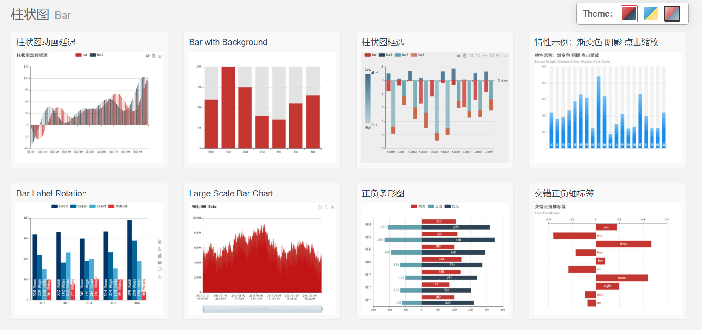


近期遇到了一个关于图片的问题，在此简单记录，方便记忆


### 什么是ECharts

ECharts，一个使用 JavaScript 实现的开源可视化库，可以流畅的运行在 PC 和移动设备上，兼容当前绝大部分浏览器（IE8/9/10/11，Chrome，Firefox，Safari等），底层依赖矢量图形库 `ZRender`，提供直观，交互丰富，可高度个性化定制的数据可视化图表。

ECharts 提供了常规的`折线图`、`柱状图`、`散点图`、`饼图`、`K线图`，用于统计的`盒形图`，用于地理数据可视化的`地图`、`热力图`、`线图`，用于关系数据可视化的`关系图`、`treemap`、`旭日图`，多维数据可视化的`平行坐标`还有用于 BI 的`漏斗图`，`仪表盘`，并且支持图与图之间的混搭。



具体介绍和一些其他的实例可以去它的 [官网](https://echarts.apache.org/zh/feature.html) 进行查看


配置安装 可以查看 [官方文档](https://echarts.apache.org/zh/tutorial.html#5%20%E5%88%86%E9%92%9F%E4%B8%8A%E6%89%8B%20ECharts)

### 配置

当然，示例肯定都是写死的数据，而我们一般使用肯定是需要从数据库来获取数据的。

下面记录一下最近碰到的一个图表，它是一个横向的柱状图，还需要一个排序的功能。

在引入完 ECharts 所需要的一些东西之后，就可以使用了，下方是一段 实例代码。

**首先，需要写一个 div 容器 ，里面用来存放绘制的图表**

```html
            <div class="col-sm-12 search-collapse">
                <!--下方这个div是需要用到的那两个排序按钮-->
                <div style="margin:10px;">
                    <input type="radio" checked name="tong" onclick="getmoney1()"><label>前10名</label>
                    <input type="radio" name="tong" onclick="getmoney2()"><label>最后10名</label>
                </div>
                <!--下方这个div就是我们需要的容器-->
                <div style="height: 200px;" id="echarts-bar-chart"></div>
            </div>
```

其次，就可以写相应的处理代码了，由于我使用的是若依的框架，可以在对应的地方直接写

````javascript
<script th:inline="javascript">
    var prefix = ctx + "接口地址";
    var school = [];		//定义一个数组,用来存储具体的学校名称
    var total = [];		//定义一个数组,用来存储每个学校具体的盈利金额
    let that = this;		//定义一个 that,把 this 赋给它
    var money = true;		//定义一个 money ,用于在后面进行判断
    window.onload = function () {	//用于在网页加载完毕后立刻执行的操作，即当html加载完毕后，立刻执行某个方法等
        getsearch();	//搜索方法
    }

    function getsearch() {	//搜索方法
        setecharts();	//图表方法
        $.table.search();	//若依自带的搜索
    }

    function getreset() {	//重置方法
        $.form.reset();	//若依自带的重置
        getmoney1();	//重置后调用前10名
    }

    function setecharts() {
        var config = {
            url: prefix,	//即上方定义的请求路径
            data: $('#formId').serialize(),	//序列化表单值
            type: "post",	//请求方式
            async: true,	//是否异步
            beforeSend: function () {
                $.modal.loading("正在处理中，请稍后...");	//打开遮罩层
            },
            success: function (result) {	//获取数据
                that.school = [];	//先把数组赋空
                that.total = [];	//先把数组赋空
                let len = result.rows.length;	//获取数据的长度
                var arr = result.rows;	//长度
                if (that.money)		//用来判断是 前10名 还是 最后10名
                    arr.sort(function (a, b) {
                        return a.classaway - b.classaway
                    });
                else
                    arr.sort(function (a, b) {
                        return b.classaway - a.classaway
                    });
                console.log("长度", len)
                for (let i = 0; i < len; i++) {	//for循环给数组进行赋值
                    that.school[i] = arr[i].deptName;
                    that.total[i] = arr[i].classaway;
                }
                var date = setInterval(() => {	//传递数据
                    clearInterval(date);
                    getexchart(school, total)
                    $.modal.closeLoading();	//关闭遮罩层
                }, 500);	// 500 表示延迟时间
            }
        };
        $.ajax(config)
    }

    function getmoney() {	//前10名
        that.money = true;
        getsearch()
    }

    function getmoney2() {	//最后10名
        that.money = false;
        getsearch()
    }


    function getexchart(n, t) { // n 代表 学习 ,t 代表金额
        var barChart = echarts.init(document.getElementById("echarts-bar-chart"));
        var baroption = {
            title: {},
            tooltip: {
                trigger: 'axis',
            },
            color: ['#FF7F50'],	//柱状图的颜色
            legend: {
                data: ['自定义名称'],	//可以自定义昵称
            },
            grid: {
                left: 20,
                top: 20,
                right: 20,
                bottom: 20,
                containLabel: true
            },
            calculable: true,
            xAxis: [
                {
                    type: 'value',
                    boundaryGap: [0, 0.01]
                }
            ],
            yAxis: {
                data: n	//赋值
            },
            series: [
                {
                    name: '2020年',
                    type: 'bar',
                    barMaxWidth: '40%',
                    data: t	//赋值
                },

            ]
        };
        barChart.setOption(baroption);
        window.onresize = barChart.resize;

    }


</script>
````

